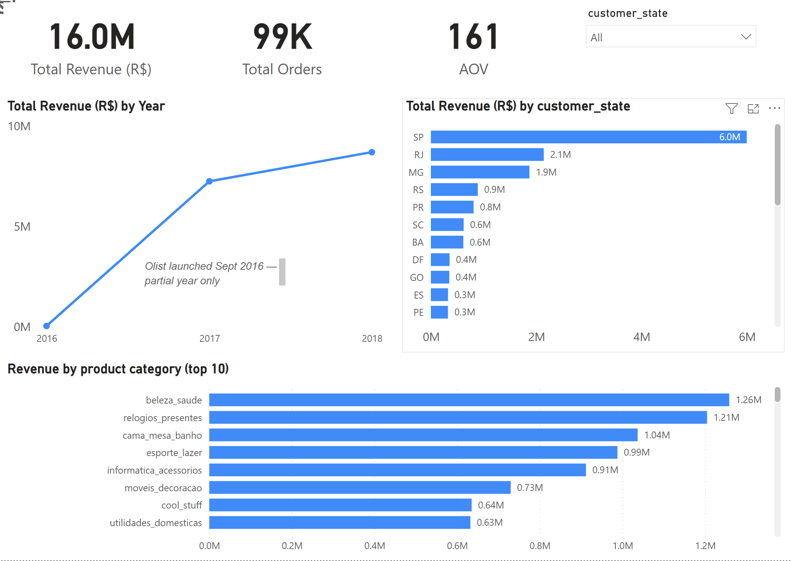

# Olist E-Commerce Sales Dashboard — Power BI



## Overview

An interactive Power BI dashboard built on the Brazilian Olist e-commerce dataset. The project analyses sales performance, revenue trends, customer distribution across states, and top-performing product categories — providing a business-focused view of over 99,000 orders and R$16M in revenue between 2016 and 2018.

---

## Dashboard

### KPI metrics
| Metric | Value |
|---|---|
| Total Revenue | R$ 16.0M |
| Total Orders | 99K |
| Average Order Value | R$ 161 |

### Visualisations
- **Revenue trend over time** — line chart showing growth from 2016 to 2018
- **Revenue by state** — top 10 Brazilian states ranked by revenue
- **Revenue by product category** — top 10 categories ranked by total sales value

### Interactive filters
- Date slicer — filter all visuals by time period
- State dropdown — filter all visuals by customer state

---

## Key Insights

- **São Paulo dominates** — SP accounts for approximately 37% of total revenue at R$6.0M, more than double the next state (RJ at R$2.1M)
- **Strong growth trajectory** — revenue grew consistently from 2016 to 2018, with 2016 showing partial year data as Olist launched in September 2016
- **Top category is health & beauty** — `beleza_saude` leads with R$1.26M, closely followed by watches & gifts (`relogios_presentes`) at R$1.21M
- **Category names are in Portuguese** — as provided in the original Olist public dataset

---

## Technical Details

### Tools & technologies
- Power BI Desktop
- DAX (Data Analysis Expressions)
- Data modelling — star schema with 6 related tables

### DAX measures created
```
Total Revenue (R$) = SUM(olist_order_payments_dataset[payment_value])
Total Orders = COUNTROWS(olist_orders_dataset)
AOV = DIVIDE([Total Revenue (R$)], [Total Orders], 0)
SP Share % = DIVIDE(CALCULATE(SUM(olist_order_payments_dataset[payment_value]), olist_customers_dataset[customer_state] = "SP"), SUM(olist_order_payments_dataset[payment_value]), 0)
On Time Delivery % = DIVIDE(COUNTROWS(FILTER(olist_orders_dataset, olist_orders_dataset[order_delivered_customer_date] <= olist_orders_dataset[order_estimated_delivery_date])), COUNTROWS(olist_orders_dataset), 0)
Avg Review Score = AVERAGE(olist_order_reviews_dataset[review_score])
```

### Data model
6 related tables connected via order_id, customer_id, product_id and seller_id:
- `olist_orders_dataset`
- `olist_order_items_dataset`
- `olist_order_payments_dataset`
- `olist_customers_dataset`
- `olist_products_dataset`
- `olist_sellers_dataset`

---

## Dataset

- **Source:** [Olist Brazilian E-Commerce Dataset — Kaggle](https://www.kaggle.com/datasets/olistbr/brazilian-ecommerce)
- **Period:** September 2016 — August 2018
- **Size:** ~100K orders across 27 Brazilian states
- **Note:** 2016 data represents a partial year only as Olist launched in September 2016

---

## How to Use

1. Download the dashboard file here: [Olist_Ecommerce_Sales_Dashboard.pbix](https://drive.google.com/file/d/1FiCK6kPaWH7Pj3_F7sY09O43qHP1NcT-/view?usp=share_link)
2. Open in Power BI Desktop (free download at powerbi.microsoft.com)
3. Use the state dropdown to filter by region
4. Use the date slicer to analyse specific time periods
5. Click any bar or data point to cross-filter all visuals

---

## Skills Demonstrated

- Data modelling with multiple related tables and defined relationships
- DAX measures for KPIs, percentage calculations, and conditional logic
- Interactive dashboard design with slicers and cross-filtering
- Business data analysis and insight communication
- Data visualisation best practices

---

## Author

**Nadir Calin** — Aspiring Data Analyst

---

*This project uses a publicly available dataset. Built as part of a data analyst portfolio.*
